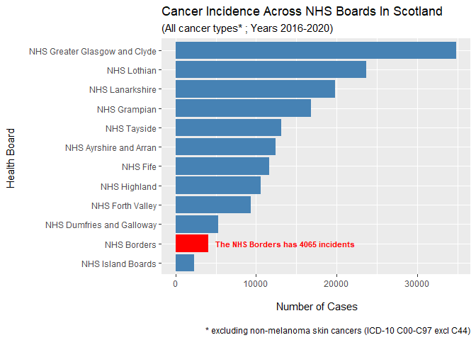
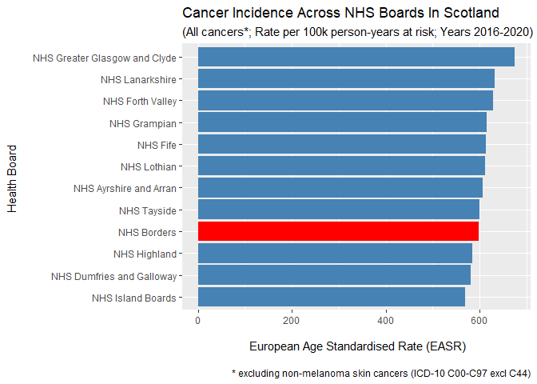
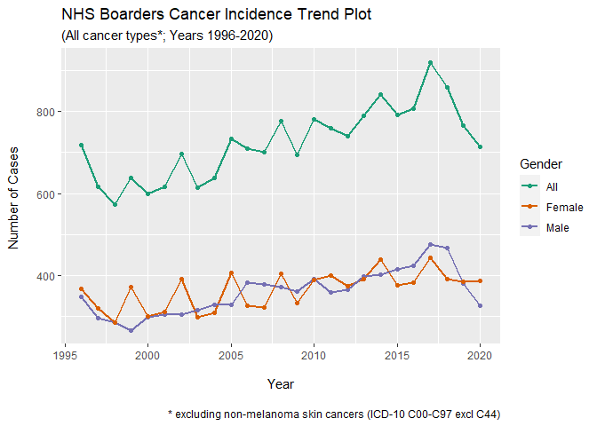
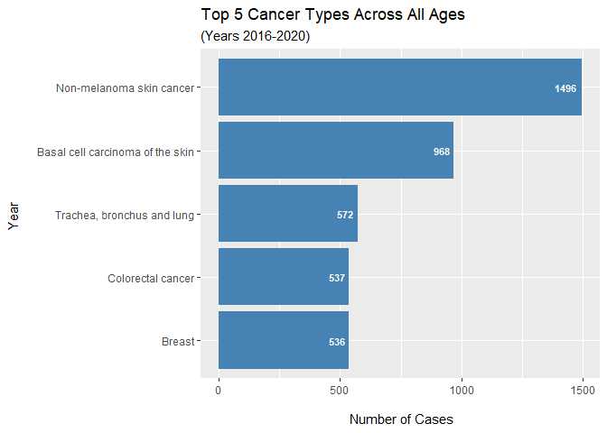
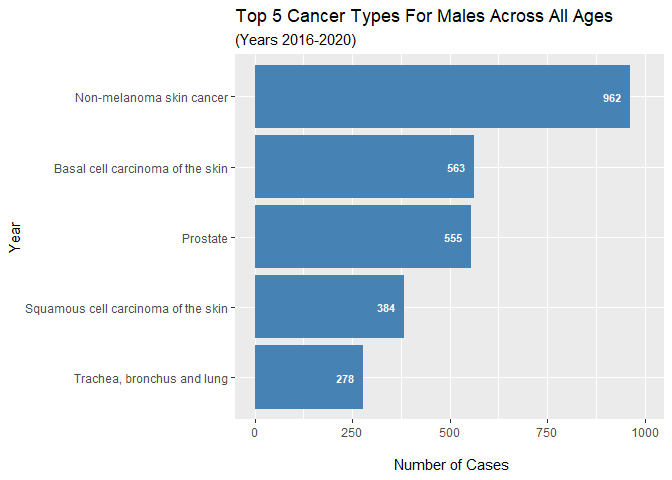
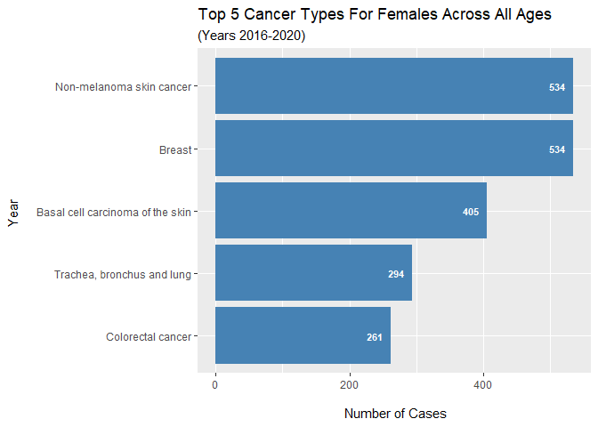
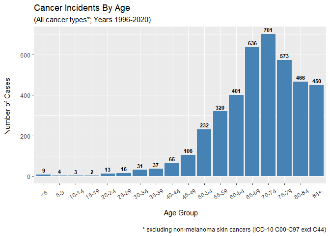
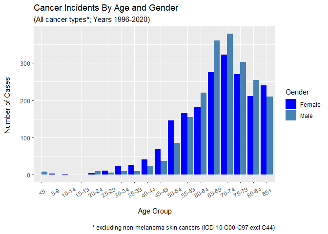

# Load Data


Load libraries:

```r
library(tidyverse)
library(janitor)
library(here)
library(ggthemes)
```

Run clean data R script:

```r
source(here("scripts/clean_nhs_borders_data.R"))
```

# Visualisations

## NHS Borders Ranking Against Other NHBs


```
## Warning: Removed 11 rows containing missing values (geom_text).
```




<br>



## Cancer Incident Trend




## Overview Of 5-Year Summary Data 





<br>



<br>



<br>


<br>






# Insights

- The NHS Borders are on the lower end of cancer cases in Scotland (years 2016-2020).
- The overall number of cancer incidents is steadily increasing with time (years 1996-2020). 
- The cancer incidents between males and females are comparable.
- The drop in the cancer incidents observed in 2019 and 2020 is mainly driven by the drop in male cancer cases.
- Skin type cancers are the most common for all genders in 2016-2020. They account for 60% of the top 5 cancer incidents.
- Prostate ranks No.3 among the most common cancers for males (years 2016-2020).
- Breast cancer ranks No.2 among the most common cancers for females (years 2016-2020).
- The most affected age group from cancer is between ``70-74``, followed by the ``65-69`` and ``75-79`` age groups. These 3 age groups account for approx. 50% of the cancer cases in the NHS Borders (years 2016-2020).
- Cancer incidences are higher for females in the ``25-59`` range and males in the ``60-79`` range (different cancer types affecting males/females)
