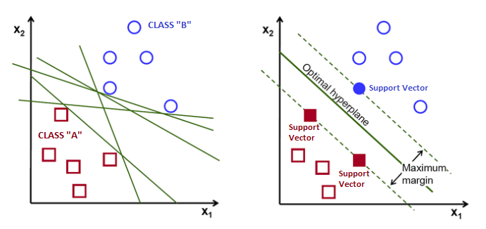

```{r setup, include=FALSE}
# knitr::opts_chunk$set(echo = TRUE)
knitr::opts_chunk$set(echo = FALSE, fig.align = 'center')
```

# Introduction

Classification and clustering are two pattern identification methods used in machine learning. Although similar, classification uses predefined classes in which objects are assigned, while clustering identifies similarities between objects, and groups them accordingly. These groups are known as "clusters".

A Support Vector Machine (SVM) is a supervised machine learning method used for solving classification problems.


## How do SVMs work

SVMs are based on the idea of finding a hyperplane that best divides a dataset into two classes, as shown in the 2D example below.

```{r, echo=FALSE, out.width = '120%'}


```
Support vectors are the data points nearest to the hyperplane (line in the 2D case). If these points were  removed, they would alter the position of the dividing hyperplane. The goal is to select SVs, such that the so called margin – the corridor between the separating hyperplanes – is maximal.


## Strengths/Weaknesses

Strengths:

+ Works well when there is a clear margin of separation between classes
+ Effective in high dimensional spaces
+ Handles non-linear data efficiently
+ Stability - small changes to the data do not affect greatly the hyperplane and the SVMs


Weaknesses:

+ Computationally demanding with large datasets (increased  training time)
+ Less effective on noisier datasets with overlapping classes
+ Requires feature scaling
+ Lack of probabilistic explanation for the classification
+ Interpretation of results can be more difficult than other methods (e.g. Decision Trees).

# Suitable Areas of Application

SVMs have been successfully applied to: 

+ optical character recognition (eg postal automation services)
+ early medical diagnostics / image recognition challenges
+ text classification (eg category assignment, detecting spam and sentiment analysis) 

