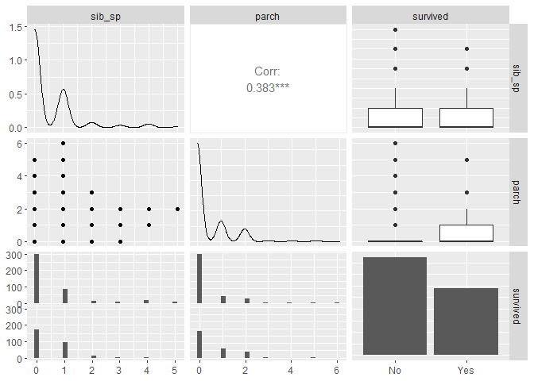
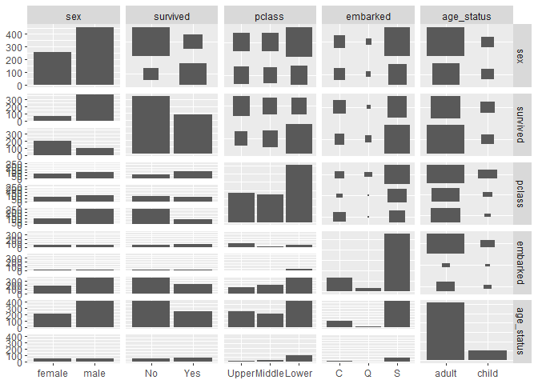
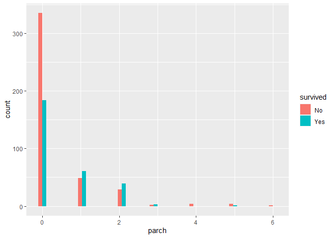
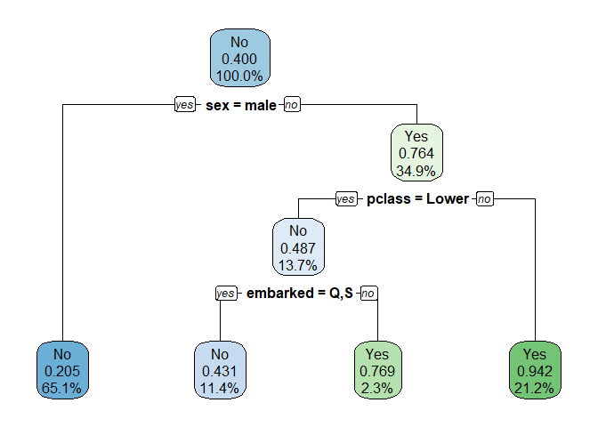
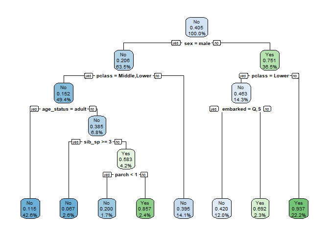
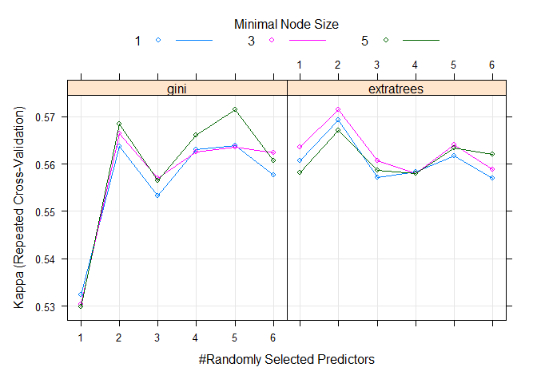

<br>
In this homework we will create a decision tree to see which factors are useful in predicting whether or not a passenger on the titanic will survive.  


Run the code below before you begin: 


```r
library(rpart)
library(rpart.plot)
library(tidyverse)

library(tidyverse)
titanic_set <- read_csv('data/titanic_decision_tree_data.csv')

shuffle_index <- sample(1:nrow(titanic_set))

# shuffle the data so class order isn't in order - need this for training/testing split later on 
titanic_set <- titanic_set[shuffle_index, ]
```

<br>

**Data Dictionary**

  * **sex**: Biological Sex, male or female  
  * **age_status**: adult or child (child defined as under 16)  
  * **class** : Ticket class, 1 = 1st (Upper class), 2 = 2nd (Middle Class), 3 = 3rd (Lower Class)    
  * **port_embarkation**: C = Cherbourg, Q = Queenstown, S = Southampton  
  * **sibsp** : number of siblings / spouses aboard the Titanic   
  * **parch**: number of parents / children aboard the Titanic. Some children travelled only with a nanny, therefore parch=0 for them. 
  * **survived_flag** : did they survive, 0 = No, 1 = Yes  


# MVP 


## Question 1  

<br> 
Cleaning up the data is always the first step. Do the following: 

  * Take only observations which have a `survived` flag (i.e. that aren't missing)  
  * Turn your important variables into factors (sex, survived, pclass, embarkation)  
  * Create an `age_status` variable which groups individuals under (and including) 16 years of age into a category called "child" category and those over 16 into a category called "adult".  
  * Drop the NA  
  * Drop any variables you don't need (`X1`, `passenger_id`, `name`, `ticket`, `far`, `cabin`)  

<br>

**Ans**

View data:

```r
titanic_set %>%
  glimpse()
```

```
## Rows: 1,309
## Columns: 13
## $ ...1         <dbl> 51, 963, 378, 1133, 524, 226, 940, 385, 988, 604, 1000, 1~
## $ passenger_id <dbl> 942, 545, 1269, 715, 106, 1117, 522, 1276, 570, 186, 582,~
## $ pclass       <dbl> 1, 1, 2, 2, 3, 3, 3, 2, 3, 1, 1, 3, 3, 3, 3, 3, 1, 3, 1, ~
## $ name         <chr> "Smith, Mr. Lucien Philip", "Douglas, Mr. Walter Donald",~
## $ sex          <chr> "male", "male", "male", "male", "male", "female", "male",~
## $ age          <dbl> 24.0, 50.0, 21.0, 52.0, 28.0, NA, 22.0, NA, 32.0, NA, 39.~
## $ sib_sp       <dbl> 1, 1, 0, 0, 0, 0, 0, 0, 0, 0, 1, 1, 0, 0, 0, 0, 0, 5, 1, ~
## $ parch        <dbl> 0, 0, 0, 0, 0, 2, 0, 0, 0, 0, 1, 1, 0, 0, 0, 0, 0, 2, 0, ~
## $ ticket       <chr> "13695", "PC 17761", "29107", "250647", "349207", "2661",~
## $ fare         <dbl> 60.0000, 106.4250, 11.5000, 13.0000, 7.8958, 15.2458, 7.8~
## $ cabin        <chr> "C31", "C86", NA, NA, NA, NA, NA, NA, NA, "A32", "C68", N~
## $ embarked     <chr> "S", "C", "S", "S", "S", "C", "S", "S", "S", "S", "C", "S~
## $ survived     <dbl> NA, 0, NA, 0, 0, NA, 0, NA, 1, 0, 1, 0, NA, 0, 1, 0, 1, 0~
```
Check for NA values:

```r
titanic_set %>% 
  summarise(across(.cols = everything(),
                   .fns = ~sum(is.na(.x))))
```

<div data-pagedtable="false">
  <script data-pagedtable-source type="application/json">
{"columns":[{"label":["...1"],"name":[1],"type":["int"],"align":["right"]},{"label":["passenger_id"],"name":[2],"type":["int"],"align":["right"]},{"label":["pclass"],"name":[3],"type":["int"],"align":["right"]},{"label":["name"],"name":[4],"type":["int"],"align":["right"]},{"label":["sex"],"name":[5],"type":["int"],"align":["right"]},{"label":["age"],"name":[6],"type":["int"],"align":["right"]},{"label":["sib_sp"],"name":[7],"type":["int"],"align":["right"]},{"label":["parch"],"name":[8],"type":["int"],"align":["right"]},{"label":["ticket"],"name":[9],"type":["int"],"align":["right"]},{"label":["fare"],"name":[10],"type":["int"],"align":["right"]},{"label":["cabin"],"name":[11],"type":["int"],"align":["right"]},{"label":["embarked"],"name":[12],"type":["int"],"align":["right"]},{"label":["survived"],"name":[13],"type":["int"],"align":["right"]}],"data":[{"1":"0","2":"0","3":"0","4":"0","5":"0","6":"263","7":"0","8":"0","9":"0","10":"1","11":"1014","12":"2","13":"418"}],"options":{"columns":{"min":{},"max":[10]},"rows":{"min":[10],"max":[10]},"pages":{}}}
  </script>
</div>

Clean-up data (if you follow blindly the instructions above, the resulting dataset will have very few rows (about 183) because drop_na() is not called at the end of the code chunk):

```r
titanic_clean <- titanic_set %>% 
  # remove observations which have a ``survived`` flag equal to NA
  filter(!is.na(survived))  %>% 
  # create an ``age_status`` variable and factor important variables  
  mutate(
    sex = as.factor(sex), 
    survived = factor(survived, levels = c(0,1), labels = c("No", "Yes")), 
    pclass = factor(pclass, levels = c(1, 2, 3), labels = c("Upper", "Middle", "Lower")), 
    embarked = as.factor(embarked),
    age_status = as.factor(if_else(age <= 16, "child", "adult"))
  ) %>% 
  # keep useful variables
  select(sex, survived, pclass, embarked, age_status, sib_sp, parch) %>% 
  # drop NA values
  drop_na()

glimpse(titanic_clean)
```

```
## Rows: 712
## Columns: 7
## $ sex        <fct> male, male, male, male, male, female, male, male, female, m~
## $ survived   <fct> No, No, No, No, Yes, Yes, No, No, Yes, No, Yes, No, Yes, Ye~
## $ pclass     <fct> Upper, Middle, Lower, Lower, Lower, Upper, Lower, Lower, Lo~
## $ embarked   <fct> C, S, S, S, S, C, S, C, S, S, S, S, C, S, S, C, Q, S, C, S,~
## $ age_status <fct> adult, adult, adult, adult, adult, adult, adult, adult, adu~
## $ sib_sp     <dbl> 1, 0, 0, 0, 0, 1, 1, 0, 0, 0, 0, 5, 1, 0, 0, 1, 0, 0, 0, 1,~
## $ parch      <dbl> 0, 0, 0, 0, 0, 1, 1, 0, 0, 0, 0, 2, 0, 0, 0, 0, 0, 0, 0, 2,~
```

Check for NA values:

```r
titanic_clean %>% 
  summarise(across(.cols = everything(),
                   .fns = ~sum(is.na(.x))))
```

<div data-pagedtable="false">
  <script data-pagedtable-source type="application/json">
{"columns":[{"label":["sex"],"name":[1],"type":["int"],"align":["right"]},{"label":["survived"],"name":[2],"type":["int"],"align":["right"]},{"label":["pclass"],"name":[3],"type":["int"],"align":["right"]},{"label":["embarked"],"name":[4],"type":["int"],"align":["right"]},{"label":["age_status"],"name":[5],"type":["int"],"align":["right"]},{"label":["sib_sp"],"name":[6],"type":["int"],"align":["right"]},{"label":["parch"],"name":[7],"type":["int"],"align":["right"]}],"data":[{"1":"0","2":"0","3":"0","4":"0","5":"0","6":"0","7":"0"}],"options":{"columns":{"min":{},"max":[10]},"rows":{"min":[10],"max":[10]},"pages":{}}}
  </script>
</div>


<br>

## Question 2  

<br> 
Have a look at your data and create some plots to ensure you know what you're working with before you begin. Write a summary of what you have found in your plots. Which variables do you think might be useful to predict whether or not people are going to die? Knowing this before you start is the best way to have a sanity check that your model is doing a good job.  

<br>
**Ans**
To find relationships between variables, split data in numeric and non-numeric

```r
titanic_clean_numeric <- titanic_clean %>%
  select_if(is.numeric)

titanic_clean_numeric$survived <- titanic_clean$survived


titanic_clean_nonnumeric <- titanic_clean %>%
  select_if(function(x) !is.numeric(x))
```


View correlations 

```r
library(GGally)
```

```
## Warning: package 'GGally' was built under R version 4.1.3
```

```
## Registered S3 method overwritten by 'GGally':
##   method from   
##   +.gg   ggplot2
```

```r
titanic_clean_numeric %>%
  ggpairs() 
```

```
## `stat_bin()` using `bins = 30`. Pick better value with `binwidth`.
```

```
## `stat_bin()` using `bins = 30`. Pick better value with `binwidth`.
```




```r
titanic_clean_nonnumeric %>%
  ggpairs()
```



Check if ``parch`` is worth including in variables useful for prediction:

```r
titanic_clean_numeric %>% 
  ggplot() +
  aes(x = parch, fill = survived) +
  geom_histogram(position = "dodge") 
```

```
## `stat_bin()` using `bins = 30`. Pick better value with `binwidth`.
```



Variables that are likely to be useful for prediction:

* ``parch`` (the histogram distribution with ``survived`` variable  shows some variation)

* ``embrarked`` (the bar plots with ``survived`` show some variation)

* ``pclass`` (the bar plots with ``survived`` show some variation)

* ``sex`` (the bar plots with ``survived`` show some variation)

* ``age_status`` (the bar plots with ``survived`` show some variation)


## Question 3  

<br> 
Now you can start to build your model. Create your testing and training set using an appropriate split. Check you have balanced sets. Write down why you chose the split you did and produce output tables to show whether or not it is balanced. [**Extra** - if you want to force balanced testing and training sets, have a look at the `stratified()` function in package `splitstackshape` (you can specify multiple variables to stratify on by passing a vector of variable names to the `group` argument, and get back testing and training sets with argument `bothSets = TRUE`)]

**Ans**


```r
# set the random seed number
set.seed(45678)
```


Case#1: 80-20 split without stratification:

```r
n_data <- nrow(titanic_clean)

# create a test sample index
test_index <- sample(1:n_data, size = n_data*0.2)

# create test set
titanic_test  <- slice(titanic_clean, test_index)

# create training set
titanic_train <- slice(titanic_clean, -test_index)
```


```r
# check balanced sets
titanic_test %>%
 janitor::tabyl(survived)
```

<div data-pagedtable="false">
  <script data-pagedtable-source type="application/json">
{"columns":[{"label":["survived"],"name":[1],"type":["fct"],"align":["left"]},{"label":["n"],"name":[2],"type":["int"],"align":["right"]},{"label":["percent"],"name":[3],"type":["dbl"],"align":["right"]}],"data":[{"1":"No","2":"82","3":"0.5774648"},{"1":"Yes","2":"60","3":"0.4225352"}],"options":{"columns":{"min":{},"max":[10]},"rows":{"min":[10],"max":[10]},"pages":{}}}
  </script>
</div>


```r
titanic_train %>%
  janitor::tabyl(survived)
```

<div data-pagedtable="false">
  <script data-pagedtable-source type="application/json">
{"columns":[{"label":["survived"],"name":[1],"type":["fct"],"align":["left"]},{"label":["n"],"name":[2],"type":["int"],"align":["right"]},{"label":["percent"],"name":[3],"type":["dbl"],"align":["right"]}],"data":[{"1":"No","2":"342","3":"0.6"},{"1":"Yes","2":"228","3":"0.4"}],"options":{"columns":{"min":{},"max":[10]},"rows":{"min":[10],"max":[10]},"pages":{}}}
  </script>
</div>

Case#2: 80-20 split with stratification per the variables shown below (I didn't stratify per ``parch`` because there weren't enough rows for all distinct groups):

```r
library(splitstackshape)
```

```
## Warning: package 'splitstackshape' was built under R version 4.1.3
```

```r
sets <- stratified(titanic_clean, group = c("survived", "embarked", "pclass", "sex", "age_status"), bothSets = TRUE, size = 0.2)

titanic_test_strat <- sets$SAMP1
titanic_train_strat <- sets$SAMP2


tibble(
  nrows_testing_strat = nrow(titanic_test_strat),
  nrows_training_strat = nrow(titanic_train)
)
```

<div data-pagedtable="false">
  <script data-pagedtable-source type="application/json">
{"columns":[{"label":["nrows_testing_strat"],"name":[1],"type":["int"],"align":["right"]},{"label":["nrows_training_strat"],"name":[2],"type":["int"],"align":["right"]}],"data":[{"1":"139","2":"570"}],"options":{"columns":{"min":{},"max":[10]},"rows":{"min":[10],"max":[10]},"pages":{}}}
  </script>
</div>

Check percentages of stratified variables (testing and training)

1. Variable ``survived``

```r
titanic_test_strat %>%
 janitor::tabyl(survived)
```

<div data-pagedtable="false">
  <script data-pagedtable-source type="application/json">
{"columns":[{"label":["survived"],"name":[1],"type":["fct"],"align":["left"]},{"label":["n"],"name":[2],"type":["int"],"align":["right"]},{"label":["percent"],"name":[3],"type":["dbl"],"align":["right"]}],"data":[{"1":"No","2":"83","3":"0.5971223"},{"1":"Yes","2":"56","3":"0.4028777"}],"options":{"columns":{"min":{},"max":[10]},"rows":{"min":[10],"max":[10]},"pages":{}}}
  </script>
</div>


```r
titanic_train_strat %>%
 janitor::tabyl(survived)
```

<div data-pagedtable="false">
  <script data-pagedtable-source type="application/json">
{"columns":[{"label":["survived"],"name":[1],"type":["fct"],"align":["left"]},{"label":["n"],"name":[2],"type":["int"],"align":["right"]},{"label":["percent"],"name":[3],"type":["dbl"],"align":["right"]}],"data":[{"1":"No","2":"341","3":"0.5951134"},{"1":"Yes","2":"232","3":"0.4048866"}],"options":{"columns":{"min":{},"max":[10]},"rows":{"min":[10],"max":[10]},"pages":{}}}
  </script>
</div>

2. Variable ``embarked``

```r
titanic_test_strat %>%
 janitor::tabyl(embarked)
```

<div data-pagedtable="false">
  <script data-pagedtable-source type="application/json">
{"columns":[{"label":["embarked"],"name":[1],"type":["fct"],"align":["left"]},{"label":["n"],"name":[2],"type":["int"],"align":["right"]},{"label":["percent"],"name":[3],"type":["dbl"],"align":["right"]}],"data":[{"1":"C","2":"23","3":"0.16546763"},{"1":"Q","2":"5","3":"0.03597122"},{"1":"S","2":"111","3":"0.79856115"}],"options":{"columns":{"min":{},"max":[10]},"rows":{"min":[10],"max":[10]},"pages":{}}}
  </script>
</div>


```r
titanic_train_strat %>%
 janitor::tabyl(embarked)
```

<div data-pagedtable="false">
  <script data-pagedtable-source type="application/json">
{"columns":[{"label":["embarked"],"name":[1],"type":["fct"],"align":["left"]},{"label":["n"],"name":[2],"type":["int"],"align":["right"]},{"label":["percent"],"name":[3],"type":["dbl"],"align":["right"]}],"data":[{"1":"C","2":"107","3":"0.18673647"},{"1":"Q","2":"23","3":"0.04013962"},{"1":"S","2":"443","3":"0.77312391"}],"options":{"columns":{"min":{},"max":[10]},"rows":{"min":[10],"max":[10]},"pages":{}}}
  </script>
</div>


3. Variable ``pclass`` 

```r
titanic_test_strat %>%
 janitor::tabyl(pclass)
```

<div data-pagedtable="false">
  <script data-pagedtable-source type="application/json">
{"columns":[{"label":["pclass"],"name":[1],"type":["fct"],"align":["left"]},{"label":["n"],"name":[2],"type":["int"],"align":["right"]},{"label":["percent"],"name":[3],"type":["dbl"],"align":["right"]}],"data":[{"1":"Upper","2":"36","3":"0.2589928"},{"1":"Middle","2":"33","3":"0.2374101"},{"1":"Lower","2":"70","3":"0.5035971"}],"options":{"columns":{"min":{},"max":[10]},"rows":{"min":[10],"max":[10]},"pages":{}}}
  </script>
</div>


```r
titanic_train_strat %>%
 janitor::tabyl(pclass)
```

<div data-pagedtable="false">
  <script data-pagedtable-source type="application/json">
{"columns":[{"label":["pclass"],"name":[1],"type":["fct"],"align":["left"]},{"label":["n"],"name":[2],"type":["int"],"align":["right"]},{"label":["percent"],"name":[3],"type":["dbl"],"align":["right"]}],"data":[{"1":"Upper","2":"148","3":"0.2582897"},{"1":"Middle","2":"140","3":"0.2443281"},{"1":"Lower","2":"285","3":"0.4973822"}],"options":{"columns":{"min":{},"max":[10]},"rows":{"min":[10],"max":[10]},"pages":{}}}
  </script>
</div>

4. Variable ``sex``

```r
titanic_test_strat %>%
 janitor::tabyl(sex)
```

<div data-pagedtable="false">
  <script data-pagedtable-source type="application/json">
{"columns":[{"label":["sex"],"name":[1],"type":["fct"],"align":["left"]},{"label":["n"],"name":[2],"type":["int"],"align":["right"]},{"label":["percent"],"name":[3],"type":["dbl"],"align":["right"]}],"data":[{"1":"female","2":"50","3":"0.3597122"},{"1":"male","2":"89","3":"0.6402878"}],"options":{"columns":{"min":{},"max":[10]},"rows":{"min":[10],"max":[10]},"pages":{}}}
  </script>
</div>


```r
titanic_train_strat %>%
 janitor::tabyl(sex)
```

<div data-pagedtable="false">
  <script data-pagedtable-source type="application/json">
{"columns":[{"label":["sex"],"name":[1],"type":["fct"],"align":["left"]},{"label":["n"],"name":[2],"type":["int"],"align":["right"]},{"label":["percent"],"name":[3],"type":["dbl"],"align":["right"]}],"data":[{"1":"female","2":"209","3":"0.3647469"},{"1":"male","2":"364","3":"0.6352531"}],"options":{"columns":{"min":{},"max":[10]},"rows":{"min":[10],"max":[10]},"pages":{}}}
  </script>
</div>

5. Variable ``age_status``

```r
titanic_test_strat %>%
 janitor::tabyl(age_status)
```

<div data-pagedtable="false">
  <script data-pagedtable-source type="application/json">
{"columns":[{"label":["age_status"],"name":[1],"type":["fct"],"align":["left"]},{"label":["n"],"name":[2],"type":["int"],"align":["right"]},{"label":["percent"],"name":[3],"type":["dbl"],"align":["right"]}],"data":[{"1":"adult","2":"119","3":"0.8561151"},{"1":"child","2":"20","3":"0.1438849"}],"options":{"columns":{"min":{},"max":[10]},"rows":{"min":[10],"max":[10]},"pages":{}}}
  </script>
</div>


```r
titanic_train_strat %>%
 janitor::tabyl(age_status)
```

<div data-pagedtable="false">
  <script data-pagedtable-source type="application/json">
{"columns":[{"label":["age_status"],"name":[1],"type":["fct"],"align":["left"]},{"label":["n"],"name":[2],"type":["int"],"align":["right"]},{"label":["percent"],"name":[3],"type":["dbl"],"align":["right"]}],"data":[{"1":"adult","2":"493","3":"0.8603839"},{"1":"child","2":"80","3":"0.1396161"}],"options":{"columns":{"min":{},"max":[10]},"rows":{"min":[10],"max":[10]},"pages":{}}}
  </script>
</div>

Check to see how stratification affects ``parch`` distinct values

```r
titanic_test_strat %>%
 janitor::tabyl(parch)
```

<div data-pagedtable="false">
  <script data-pagedtable-source type="application/json">
{"columns":[{"label":["parch"],"name":[1],"type":["dbl"],"align":["right"]},{"label":["n"],"name":[2],"type":["int"],"align":["right"]},{"label":["percent"],"name":[3],"type":["dbl"],"align":["right"]}],"data":[{"1":"0","2":"95","3":"0.683453237"},{"1":"1","2":"29","3":"0.208633094"},{"1":"2","2":"13","3":"0.093525180"},{"1":"4","2":"1","3":"0.007194245"},{"1":"5","2":"1","3":"0.007194245"}],"options":{"columns":{"min":{},"max":[10]},"rows":{"min":[10],"max":[10]},"pages":{}}}
  </script>
</div>


```r
titanic_train_strat %>%
 janitor::tabyl(parch)
```

<div data-pagedtable="false">
  <script data-pagedtable-source type="application/json">
{"columns":[{"label":["parch"],"name":[1],"type":["dbl"],"align":["right"]},{"label":["n"],"name":[2],"type":["int"],"align":["right"]},{"label":["percent"],"name":[3],"type":["dbl"],"align":["right"]}],"data":[{"1":"0","2":"424","3":"0.739965096"},{"1":"1","2":"81","3":"0.141361257"},{"1":"2","2":"55","3":"0.095986038"},{"1":"3","2":"5","3":"0.008726003"},{"1":"4","2":"3","3":"0.005235602"},{"1":"5","2":"4","3":"0.006980803"},{"1":"6","2":"1","3":"0.001745201"}],"options":{"columns":{"min":{},"max":[10]},"rows":{"min":[10],"max":[10]},"pages":{}}}
  </script>
</div>


## Question 4      

<br> 
Create your decision tree to try and predict survival probability using an appropriate method, and create a decision tree plot.

**Ans**

Case#1 - no stratification

```r
titanic_fit <- rpart(
  formula = survived ~ ., 
  data = titanic_train, 
  method = 'class'
)

rpart.plot(titanic_fit, 
           yesno = 2, 
           fallen.leaves = TRUE, 
           faclen = 6, 
           digits = 3)
```



Case#2 - stratification

```r
titanic_fit_strat <- rpart(
  formula = survived ~ ., 
  data = titanic_train_strat, 
  method = 'class'
)

rpart.plot(titanic_fit_strat, 
           yesno = 2, 
           fallen.leaves = TRUE, 
           faclen = 6, 
           digits = 3)
```



## Question 5    

<br> 
Write down what this tells you, in detail. What variables are important? What does each node tell you? Who has the highest chance of surviving? Who has the lowest? Provide as much detail as you can.    

**Ans**
Interpretation of results according to stratified data:

+ The largest group in the data (42.6%) are lower & middle class adult male passengers with a probability of survival equal to 11.5% 

+ The 2nd largest group in the data (22.2%) are middle & upper class female passengers with a probability of survival equal to 93.7%

+ The 3rd largest group in the data (14.1) are upper class adult male passengers with a probability of survival equal to 39.5%

+ The 4th largest group in the data (7.9%) are lower class female passengers with 1 sibling/spouse aboard the Titanic with a probability of survival equal to 60.0%

+ The 5th largest group in the data (6.5%) are lower class female passengers with more than 1 sibling/spouse aboard the Titanic with a probability of survival equal to 29.7%

+ The 6th largest group in the data (3.0%) are lower & middle class under-aged male passengers with less than 2 siblings/spouses and more than one parent/children aboard with a probability of survival equal to 82.4%

+ The 7th largest group in the data (2.3%) are lower & middle class under-aged male passengers with 3 or more siblings/spouses  with a probability of survival equal to 0%

+ The smallest group in the data (1.6%) are lower & middle class under-aged male passengers that traveled with a nanny with a probability of survival equal to 11.1%

<br>

## Question 6     

<br>  
Test and add your predictions to your data. Create a confusion matrix. Write down in detail what this tells you for this specific dataset.  


**Ans**

Add predictions on test dataset:

```r
library(modelr)

# add the predictions
titanic_test_strat_pred <- titanic_test_strat %>%
  add_predictions(titanic_fit_strat, type = 'class')
```


```r
# look at the variables 
titanic_test_strat_pred %>%
  select(sex, pclass, age_status, sib_sp, parch, pred)
```

<div data-pagedtable="false">
  <script data-pagedtable-source type="application/json">
{"columns":[{"label":["sex"],"name":[1],"type":["fct"],"align":["left"]},{"label":["pclass"],"name":[2],"type":["fct"],"align":["left"]},{"label":["age_status"],"name":[3],"type":["fct"],"align":["left"]},{"label":["sib_sp"],"name":[4],"type":["dbl"],"align":["right"]},{"label":["parch"],"name":[5],"type":["dbl"],"align":["right"]},{"label":["pred"],"name":[6],"type":["fct"],"align":["left"]}],"data":[{"1":"male","2":"Upper","3":"adult","4":"1","5":"1","6":"No"},{"1":"male","2":"Upper","3":"adult","4":"0","5":"0","6":"No"},{"1":"male","2":"Upper","3":"adult","4":"0","5":"0","6":"No"},{"1":"male","2":"Upper","3":"adult","4":"0","5":"1","6":"No"},{"1":"male","2":"Middle","3":"adult","4":"0","5":"0","6":"No"},{"1":"male","2":"Middle","3":"adult","4":"0","5":"0","6":"No"},{"1":"male","2":"Middle","3":"adult","4":"1","5":"1","6":"No"},{"1":"male","2":"Middle","3":"adult","4":"0","5":"0","6":"No"},{"1":"male","2":"Middle","3":"adult","4":"0","5":"0","6":"No"},{"1":"male","2":"Middle","3":"adult","4":"1","5":"0","6":"No"},{"1":"male","2":"Middle","3":"adult","4":"0","5":"0","6":"No"},{"1":"male","2":"Middle","3":"adult","4":"0","5":"0","6":"No"},{"1":"male","2":"Middle","3":"adult","4":"1","5":"0","6":"No"},{"1":"male","2":"Middle","3":"adult","4":"0","5":"0","6":"No"},{"1":"male","2":"Middle","3":"adult","4":"0","5":"0","6":"No"},{"1":"male","2":"Middle","3":"adult","4":"0","5":"0","6":"No"},{"1":"male","2":"Middle","3":"adult","4":"0","5":"0","6":"No"},{"1":"male","2":"Middle","3":"adult","4":"0","5":"0","6":"No"},{"1":"male","2":"Middle","3":"adult","4":"0","5":"0","6":"No"},{"1":"male","2":"Lower","3":"adult","4":"0","5":"1","6":"No"},{"1":"male","2":"Lower","3":"adult","4":"0","5":"0","6":"No"},{"1":"male","2":"Lower","3":"adult","4":"0","5":"0","6":"No"},{"1":"male","2":"Lower","3":"adult","4":"0","5":"0","6":"No"},{"1":"male","2":"Lower","3":"adult","4":"0","5":"0","6":"No"},{"1":"male","2":"Lower","3":"adult","4":"0","5":"0","6":"No"},{"1":"male","2":"Lower","3":"adult","4":"0","5":"0","6":"No"},{"1":"male","2":"Lower","3":"adult","4":"0","5":"0","6":"No"},{"1":"male","2":"Lower","3":"adult","4":"1","5":"5","6":"No"},{"1":"male","2":"Lower","3":"adult","4":"0","5":"0","6":"No"},{"1":"male","2":"Lower","3":"adult","4":"1","5":"0","6":"No"},{"1":"male","2":"Lower","3":"adult","4":"0","5":"0","6":"No"},{"1":"male","2":"Lower","3":"adult","4":"0","5":"0","6":"No"},{"1":"male","2":"Lower","3":"adult","4":"0","5":"0","6":"No"},{"1":"male","2":"Lower","3":"adult","4":"0","5":"0","6":"No"},{"1":"male","2":"Lower","3":"adult","4":"0","5":"0","6":"No"},{"1":"male","2":"Lower","3":"adult","4":"0","5":"0","6":"No"},{"1":"male","2":"Lower","3":"adult","4":"0","5":"0","6":"No"},{"1":"male","2":"Lower","3":"adult","4":"0","5":"0","6":"No"},{"1":"male","2":"Lower","3":"adult","4":"0","5":"0","6":"No"},{"1":"male","2":"Lower","3":"adult","4":"1","5":"0","6":"No"},{"1":"male","2":"Lower","3":"adult","4":"0","5":"0","6":"No"},{"1":"male","2":"Lower","3":"adult","4":"0","5":"0","6":"No"},{"1":"male","2":"Lower","3":"adult","4":"0","5":"0","6":"No"},{"1":"male","2":"Lower","3":"adult","4":"1","5":"4","6":"No"},{"1":"male","2":"Lower","3":"adult","4":"0","5":"0","6":"No"},{"1":"male","2":"Lower","3":"adult","4":"0","5":"0","6":"No"},{"1":"male","2":"Lower","3":"adult","4":"0","5":"0","6":"No"},{"1":"male","2":"Lower","3":"adult","4":"1","5":"1","6":"No"},{"1":"male","2":"Lower","3":"adult","4":"0","5":"0","6":"No"},{"1":"male","2":"Lower","3":"adult","4":"0","5":"0","6":"No"},{"1":"male","2":"Lower","3":"adult","4":"0","5":"0","6":"No"},{"1":"male","2":"Lower","3":"adult","4":"0","5":"0","6":"No"},{"1":"male","2":"Lower","3":"adult","4":"0","5":"0","6":"No"},{"1":"male","2":"Lower","3":"adult","4":"1","5":"0","6":"No"},{"1":"male","2":"Lower","3":"adult","4":"1","5":"0","6":"No"},{"1":"male","2":"Lower","3":"adult","4":"0","5":"0","6":"No"},{"1":"female","2":"Upper","3":"adult","4":"1","5":"1","6":"Yes"},{"1":"female","2":"Upper","3":"adult","4":"0","5":"0","6":"Yes"},{"1":"female","2":"Upper","3":"adult","4":"0","5":"2","6":"Yes"},{"1":"female","2":"Upper","3":"adult","4":"1","5":"0","6":"Yes"},{"1":"female","2":"Upper","3":"adult","4":"1","5":"0","6":"Yes"},{"1":"female","2":"Upper","3":"adult","4":"1","5":"0","6":"Yes"},{"1":"female","2":"Upper","3":"adult","4":"0","5":"0","6":"Yes"},{"1":"male","2":"Lower","3":"adult","4":"0","5":"0","6":"No"},{"1":"male","2":"Lower","3":"adult","4":"0","5":"0","6":"No"},{"1":"male","2":"Lower","3":"adult","4":"0","5":"0","6":"No"},{"1":"female","2":"Lower","3":"adult","4":"1","5":"1","6":"No"},{"1":"female","2":"Lower","3":"adult","4":"0","5":"2","6":"No"},{"1":"female","2":"Lower","3":"adult","4":"0","5":"0","6":"No"},{"1":"female","2":"Lower","3":"adult","4":"1","5":"0","6":"No"},{"1":"female","2":"Lower","3":"adult","4":"0","5":"1","6":"No"},{"1":"female","2":"Upper","3":"adult","4":"3","5":"2","6":"Yes"},{"1":"female","2":"Upper","3":"adult","4":"0","5":"0","6":"Yes"},{"1":"female","2":"Upper","3":"adult","4":"0","5":"0","6":"Yes"},{"1":"female","2":"Upper","3":"adult","4":"0","5":"0","6":"Yes"},{"1":"female","2":"Upper","3":"adult","4":"0","5":"2","6":"Yes"},{"1":"female","2":"Upper","3":"adult","4":"1","5":"0","6":"Yes"},{"1":"female","2":"Upper","3":"adult","4":"0","5":"0","6":"Yes"},{"1":"female","2":"Upper","3":"adult","4":"1","5":"2","6":"Yes"},{"1":"male","2":"Lower","3":"child","4":"1","5":"1","6":"Yes"},{"1":"male","2":"Lower","3":"child","4":"4","5":"1","6":"No"},{"1":"male","2":"Lower","3":"child","4":"5","5":"2","6":"No"},{"1":"male","2":"Lower","3":"child","4":"3","5":"1","6":"No"},{"1":"female","2":"Lower","3":"child","4":"0","5":"1","6":"Yes"},{"1":"female","2":"Lower","3":"child","4":"2","5":"1","6":"Yes"},{"1":"male","2":"Upper","3":"adult","4":"0","5":"0","6":"No"},{"1":"male","2":"Upper","3":"adult","4":"2","5":"0","6":"No"},{"1":"male","2":"Upper","3":"adult","4":"0","5":"0","6":"No"},{"1":"male","2":"Upper","3":"adult","4":"0","5":"0","6":"No"},{"1":"male","2":"Middle","3":"adult","4":"1","5":"2","6":"No"},{"1":"female","2":"Middle","3":"adult","4":"1","5":"0","6":"Yes"},{"1":"female","2":"Middle","3":"adult","4":"0","5":"0","6":"Yes"},{"1":"female","2":"Middle","3":"adult","4":"0","5":"0","6":"Yes"},{"1":"female","2":"Middle","3":"adult","4":"1","5":"0","6":"Yes"},{"1":"female","2":"Middle","3":"adult","4":"0","5":"1","6":"Yes"},{"1":"female","2":"Middle","3":"adult","4":"1","5":"1","6":"Yes"},{"1":"female","2":"Middle","3":"adult","4":"0","5":"2","6":"Yes"},{"1":"female","2":"Middle","3":"adult","4":"1","5":"2","6":"Yes"},{"1":"female","2":"Middle","3":"adult","4":"0","5":"0","6":"Yes"},{"1":"female","2":"Middle","3":"adult","4":"1","5":"1","6":"Yes"},{"1":"male","2":"Upper","3":"adult","4":"0","5":"0","6":"No"},{"1":"male","2":"Upper","3":"adult","4":"1","5":"1","6":"No"},{"1":"male","2":"Upper","3":"adult","4":"0","5":"0","6":"No"},{"1":"male","2":"Upper","3":"child","4":"1","5":"2","6":"No"},{"1":"female","2":"Middle","3":"adult","4":"1","5":"0","6":"Yes"},{"1":"female","2":"Lower","3":"adult","4":"0","5":"0","6":"No"},{"1":"female","2":"Lower","3":"adult","4":"0","5":"0","6":"No"},{"1":"female","2":"Lower","3":"adult","4":"1","5":"0","6":"No"},{"1":"female","2":"Lower","3":"adult","4":"2","5":"2","6":"No"},{"1":"female","2":"Lower","3":"adult","4":"1","5":"0","6":"No"},{"1":"female","2":"Lower","3":"adult","4":"1","5":"0","6":"No"},{"1":"male","2":"Lower","3":"child","4":"4","5":"1","6":"No"},{"1":"female","2":"Middle","3":"child","4":"1","5":"1","6":"Yes"},{"1":"female","2":"Middle","3":"child","4":"0","5":"1","6":"Yes"},{"1":"female","2":"Lower","3":"child","4":"5","5":"2","6":"No"},{"1":"female","2":"Lower","3":"child","4":"3","5":"1","6":"No"},{"1":"female","2":"Lower","3":"child","4":"4","5":"2","6":"No"},{"1":"female","2":"Lower","3":"adult","4":"0","5":"1","6":"Yes"},{"1":"male","2":"Upper","3":"adult","4":"0","5":"0","6":"No"},{"1":"male","2":"Upper","3":"adult","4":"1","5":"0","6":"No"},{"1":"male","2":"Upper","3":"adult","4":"0","5":"0","6":"No"},{"1":"male","2":"Upper","3":"adult","4":"0","5":"0","6":"No"},{"1":"male","2":"Upper","3":"adult","4":"0","5":"0","6":"No"},{"1":"male","2":"Upper","3":"adult","4":"1","5":"0","6":"No"},{"1":"male","2":"Upper","3":"adult","4":"0","5":"0","6":"No"},{"1":"male","2":"Upper","3":"adult","4":"1","5":"1","6":"No"},{"1":"female","2":"Lower","3":"child","4":"0","5":"0","6":"No"},{"1":"male","2":"Middle","3":"adult","4":"0","5":"0","6":"No"},{"1":"female","2":"Lower","3":"child","4":"0","5":"0","6":"No"},{"1":"female","2":"Lower","3":"adult","4":"1","5":"1","6":"No"},{"1":"female","2":"Middle","3":"adult","4":"1","5":"0","6":"Yes"},{"1":"male","2":"Lower","3":"adult","4":"0","5":"0","6":"No"},{"1":"male","2":"Lower","3":"adult","4":"0","5":"0","6":"No"},{"1":"male","2":"Lower","3":"adult","4":"0","5":"0","6":"No"},{"1":"female","2":"Upper","3":"child","4":"0","5":"1","6":"Yes"},{"1":"male","2":"Lower","3":"child","4":"1","5":"1","6":"Yes"},{"1":"male","2":"Lower","3":"child","4":"1","5":"1","6":"Yes"},{"1":"male","2":"Middle","3":"child","4":"1","5":"1","6":"Yes"},{"1":"male","2":"Middle","3":"child","4":"1","5":"1","6":"Yes"}],"options":{"columns":{"min":{},"max":[10]},"rows":{"min":[10],"max":[10]},"pages":{}}}
  </script>
</div>

Create confusion matrix:

```r
library(yardstick)
```

```
## Warning: package 'yardstick' was built under R version 4.1.3
```

```
## For binary classification, the first factor level is assumed to be the event.
## Use the argument `event_level = "second"` to alter this as needed.
```

```
## 
## Attaching package: 'yardstick'
```

```
## The following objects are masked from 'package:modelr':
## 
##     mae, mape, rmse
```

```
## The following object is masked from 'package:readr':
## 
##     spec
```

```r
conf_mat <- titanic_test_strat_pred %>%
              conf_mat(truth = survived, estimate = pred)

conf_mat
```

```
##           Truth
## Prediction No Yes
##        No  80  21
##        Yes  3  35
```


```r
tibble(
  accuracy = accuracy(titanic_test_strat_pred, truth = survived, estimate = pred)$.estimate,
  sensitivity = sensitivity(titanic_test_strat_pred, truth = survived, estimate = pred)$.estimate,
  specificity = specificity(titanic_test_strat_pred, truth = survived, estimate = pred)$.estimate
)
```

<div data-pagedtable="false">
  <script data-pagedtable-source type="application/json">
{"columns":[{"label":["accuracy"],"name":[1],"type":["dbl"],"align":["right"]},{"label":["sensitivity"],"name":[2],"type":["dbl"],"align":["right"]},{"label":["specificity"],"name":[3],"type":["dbl"],"align":["right"]}],"data":[{"1":"0.8273381","2":"0.9638554","3":"0.625"}],"options":{"columns":{"min":{},"max":[10]},"rows":{"min":[10],"max":[10]},"pages":{}}}
  </script>
</div>


Alternative way: Calculate the confusion matrix and accuracy using ``caret`` package:

```r
library(caret)
```

```
## Warning: package 'caret' was built under R version 4.1.3
```

```
## Loading required package: lattice
```

```
## 
## Attaching package: 'caret'
```

```
## The following objects are masked from 'package:yardstick':
## 
##     precision, recall, sensitivity, specificity
```

```
## The following object is masked from 'package:purrr':
## 
##     lift
```

```r
confusionMatrix(titanic_test_strat_pred$pred, titanic_test_strat_pred$survived) #order is estimate and then truth 
```

```
## Confusion Matrix and Statistics
## 
##           Reference
## Prediction No Yes
##        No  80  21
##        Yes  3  35
##                                           
##                Accuracy : 0.8273          
##                  95% CI : (0.7541, 0.8861)
##     No Information Rate : 0.5971          
##     P-Value [Acc > NIR] : 4.474e-09       
##                                           
##                   Kappa : 0.6213          
##                                           
##  Mcnemar's Test P-Value : 0.0005202       
##                                           
##             Sensitivity : 0.9639          
##             Specificity : 0.6250          
##          Pos Pred Value : 0.7921          
##          Neg Pred Value : 0.9211          
##              Prevalence : 0.5971          
##          Detection Rate : 0.5755          
##    Detection Prevalence : 0.7266          
##       Balanced Accuracy : 0.7944          
##                                           
##        'Positive' Class : No              
## 
```

# Extension  

See how a `ranger()` random forest classifier compares with a single decision tree in terms of performance. Can you tune the values of the `mtry`, `splitrule` and `min.node.size` hyperparameters? Which variables in the dataset turn out to be most important for your best model? The `Kappa` metric might be the best one to focus on if you want to improve performance for an imbalanced data set. Do some research on the definition of `Kappa` before you start.

We provide the code in the dropdown below if you get stuck, but still want to play around with this (note that run time can be up to 5-10 mins for the tuning). **Save your notebook before you begin** in case you need to force quit your session!


```r
library(ranger)
```

```
## Warning: package 'ranger' was built under R version 4.1.3
```

```r
control <- trainControl(
  method = "repeatedcv", 
  number = 5, 
  repeats = 10
)

tune_grid = expand.grid(
  mtry = 1:6,
  splitrule = c("gini", "extratrees"),
  min.node.size = c(1, 3, 5)
)
```


```r
rf_tune <- train(
  survived ~ ., 
  data = titanic_train_strat, 
  method = "ranger",
  metric = "Kappa",
  num.trees = 1000,
  importance = "impurity",
  tuneGrid = tune_grid, 
  trControl = control
)

plot(rf_tune)
```



```r
rf_tune
```

```
## Random Forest 
## 
## 573 samples
##   6 predictor
##   2 classes: 'No', 'Yes' 
## 
## No pre-processing
## Resampling: Cross-Validated (5 fold, repeated 10 times) 
## Summary of sample sizes: 457, 459, 459, 459, 458, 457, ... 
## Resampling results across tuning parameters:
## 
##   mtry  splitrule   min.node.size  Accuracy   Kappa    
##   1     gini        1              0.7902146  0.5323635
##   1     gini        3              0.7895478  0.5302773
##   1     gini        5              0.7893618  0.5299124
##   1     extratrees  1              0.8021185  0.5607000
##   1     extratrees  3              0.8031635  0.5635312
##   1     extratrees  5              0.8012307  0.5582019
##   2     gini        1              0.7999997  0.5637342
##   2     gini        3              0.8013865  0.5664821
##   2     gini        5              0.8019189  0.5683993
##   2     extratrees  1              0.8033224  0.5693259
##   2     extratrees  3              0.8041980  0.5714126
##   2     extratrees  5              0.8021034  0.5670321
##   3     gini        1              0.7930202  0.5532632
##   3     gini        3              0.7947715  0.5570393
##   3     gini        5              0.7946036  0.5565609
##   3     extratrees  1              0.7959874  0.5572145
##   3     extratrees  3              0.7977312  0.5607549
##   3     extratrees  5              0.7965137  0.5585861
##   4     gini        1              0.7958272  0.5630936
##   4     gini        3              0.7959920  0.5626211
##   4     gini        5              0.7975663  0.5660847
##   4     extratrees  1              0.7945900  0.5582501
##   4     extratrees  3              0.7947578  0.5580515
##   4     extratrees  5              0.7947714  0.5580065
##   5     gini        1              0.7956426  0.5638365
##   5     gini        3              0.7956486  0.5636186
##   5     gini        5              0.7996564  0.5715690
##   5     extratrees  1              0.7951193  0.5617170
##   5     extratrees  3              0.7963337  0.5640149
##   5     extratrees  5              0.7959859  0.5633406
##   6     gini        1              0.7925090  0.5576436
##   6     gini        3              0.7947821  0.5623721
##   6     gini        5              0.7942512  0.5607033
##   6     extratrees  1              0.7923245  0.5569872
##   6     extratrees  3              0.7933694  0.5588053
##   6     extratrees  5              0.7947669  0.5619891
## 
## Kappa was used to select the optimal model using the largest value.
## The final values used for the model were mtry = 5, splitrule = gini
##  and min.node.size = 5.
```


```r
rf_tune
```

```
## Random Forest 
## 
## 573 samples
##   6 predictor
##   2 classes: 'No', 'Yes' 
## 
## No pre-processing
## Resampling: Cross-Validated (5 fold, repeated 10 times) 
## Summary of sample sizes: 457, 459, 459, 459, 458, 457, ... 
## Resampling results across tuning parameters:
## 
##   mtry  splitrule   min.node.size  Accuracy   Kappa    
##   1     gini        1              0.7902146  0.5323635
##   1     gini        3              0.7895478  0.5302773
##   1     gini        5              0.7893618  0.5299124
##   1     extratrees  1              0.8021185  0.5607000
##   1     extratrees  3              0.8031635  0.5635312
##   1     extratrees  5              0.8012307  0.5582019
##   2     gini        1              0.7999997  0.5637342
##   2     gini        3              0.8013865  0.5664821
##   2     gini        5              0.8019189  0.5683993
##   2     extratrees  1              0.8033224  0.5693259
##   2     extratrees  3              0.8041980  0.5714126
##   2     extratrees  5              0.8021034  0.5670321
##   3     gini        1              0.7930202  0.5532632
##   3     gini        3              0.7947715  0.5570393
##   3     gini        5              0.7946036  0.5565609
##   3     extratrees  1              0.7959874  0.5572145
##   3     extratrees  3              0.7977312  0.5607549
##   3     extratrees  5              0.7965137  0.5585861
##   4     gini        1              0.7958272  0.5630936
##   4     gini        3              0.7959920  0.5626211
##   4     gini        5              0.7975663  0.5660847
##   4     extratrees  1              0.7945900  0.5582501
##   4     extratrees  3              0.7947578  0.5580515
##   4     extratrees  5              0.7947714  0.5580065
##   5     gini        1              0.7956426  0.5638365
##   5     gini        3              0.7956486  0.5636186
##   5     gini        5              0.7996564  0.5715690
##   5     extratrees  1              0.7951193  0.5617170
##   5     extratrees  3              0.7963337  0.5640149
##   5     extratrees  5              0.7959859  0.5633406
##   6     gini        1              0.7925090  0.5576436
##   6     gini        3              0.7947821  0.5623721
##   6     gini        5              0.7942512  0.5607033
##   6     extratrees  1              0.7923245  0.5569872
##   6     extratrees  3              0.7933694  0.5588053
##   6     extratrees  5              0.7947669  0.5619891
## 
## Kappa was used to select the optimal model using the largest value.
## The final values used for the model were mtry = 5, splitrule = gini
##  and min.node.size = 5.
```

Hyperparameters based on output of preceding code chunk

```r
rf_classifier <- ranger(survived ~ ., mtry = 2, data = titanic_train, splitrule = "gini", min.node.size = 5, num.trees = 1000, importance = "impurity")
```


Training set calcs for confusion matrix and accuracy:

```r
titanic_train_strat_pred <- titanic_train_strat %>%
  mutate(pred = predict(rf_classifier, data = titanic_train_strat)$predictions)

confusionMatrix(data = titanic_train_strat_pred$pred, reference = titanic_train_strat_pred$survived)
```

```
## Confusion Matrix and Statistics
## 
##           Reference
## Prediction  No Yes
##        No  315  73
##        Yes  26 159
##                                           
##                Accuracy : 0.8272          
##                  95% CI : (0.7937, 0.8573)
##     No Information Rate : 0.5951          
##     P-Value [Acc > NIR] : < 2.2e-16       
##                                           
##                   Kappa : 0.6295          
##                                           
##  Mcnemar's Test P-Value : 3.779e-06       
##                                           
##             Sensitivity : 0.9238          
##             Specificity : 0.6853          
##          Pos Pred Value : 0.8119          
##          Neg Pred Value : 0.8595          
##              Prevalence : 0.5951          
##          Detection Rate : 0.5497          
##    Detection Prevalence : 0.6771          
##       Balanced Accuracy : 0.8045          
##                                           
##        'Positive' Class : No              
## 
```

Test set calcs for confusion matrix and accuracy:

```r
titanic_test_strat_pred <- titanic_test_strat %>%
  mutate(pred = predict(rf_classifier, data = titanic_test_strat)$predictions)

confusionMatrix(data = titanic_test_strat_pred$pred, reference = titanic_test_strat_pred$survived)
```

```
## Confusion Matrix and Statistics
## 
##           Reference
## Prediction No Yes
##        No  77  14
##        Yes  6  42
##                                           
##                Accuracy : 0.8561          
##                  95% CI : (0.7866, 0.9098)
##     No Information Rate : 0.5971          
##     P-Value [Acc > NIR] : 2.669e-11       
##                                           
##                   Kappa : 0.6938          
##                                           
##  Mcnemar's Test P-Value : 0.1175          
##                                           
##             Sensitivity : 0.9277          
##             Specificity : 0.7500          
##          Pos Pred Value : 0.8462          
##          Neg Pred Value : 0.8750          
##              Prevalence : 0.5971          
##          Detection Rate : 0.5540          
##    Detection Prevalence : 0.6547          
##       Balanced Accuracy : 0.8389          
##                                           
##        'Positive' Class : No              
## 
```


Check measure of how important each variable is to the final performance of the classifier 

```r
importance(rf_classifier)
```

```
##        sex     pclass   embarked age_status     sib_sp      parch 
##  67.801093  31.317947   7.341306   9.809466  10.259902  11.153836
```

NB: I missed out the importance of ``sib_sp`` in MVP  Question 2 


