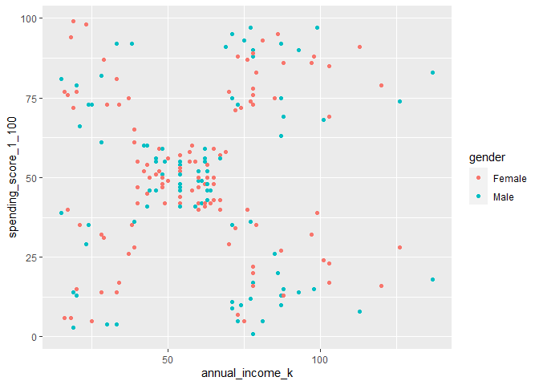
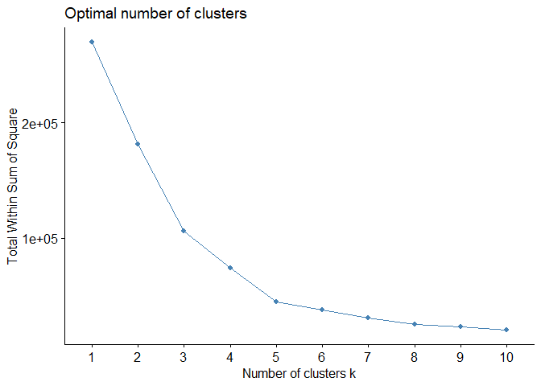
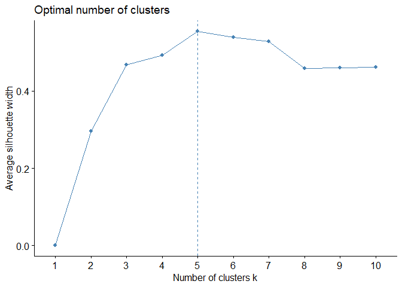
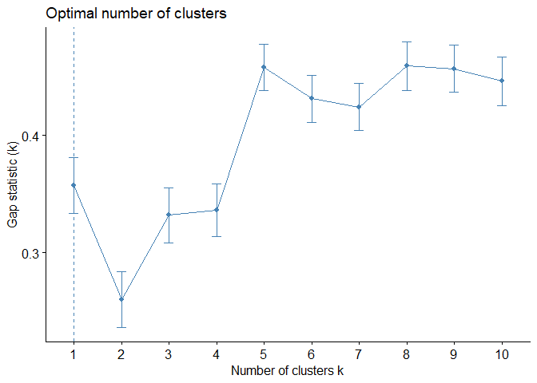
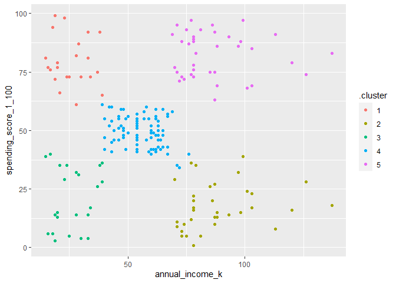

# Task 1

You have been provided some customer data from a shopping centre. Do some exploratory analysis on the data. Comment on findings. 

**Ans**

Call Libraries

```r
library(janitor)
```

```
## 
## Attaching package: 'janitor'
```

```
## The following objects are masked from 'package:stats':
## 
##     chisq.test, fisher.test
```

```r
library(here)
```

```
## Warning: package 'here' was built under R version 4.1.3
```

```
## here() starts at C:/Users/John/Documents/CodeClan/codeclan_homework_JohnHios/week_11/day_3
```

```r
library(fastDummies)
```

```
## Warning: package 'fastDummies' was built under R version 4.1.3
```

```r
library(broom)
library(tidyverse)
```

```
## -- Attaching packages --------------------------------------- tidyverse 1.3.1 --
```

```
## v ggplot2 3.3.5     v purrr   0.3.4
## v tibble  3.1.6     v dplyr   1.0.8
## v tidyr   1.2.0     v stringr 1.4.0
## v readr   2.1.2     v forcats 0.5.1
```

```
## -- Conflicts ------------------------------------------ tidyverse_conflicts() --
## x dplyr::filter() masks stats::filter()
## x dplyr::lag()    masks stats::lag()
```

```r
library(factoextra)
```

```
## Warning: package 'factoextra' was built under R version 4.1.3
```

```
## Welcome! Want to learn more? See two factoextra-related books at https://goo.gl/ve3WBa
```


Load data

```r
customers <- read_csv(here("data/mall_customers.csv")) %>% 
  clean_names()
```

```
## Rows: 200 Columns: 5
## -- Column specification --------------------------------------------------------
## Delimiter: ","
## chr (1): Gender
## dbl (4): CustomerID, Age, Annual Income (k$), Spending Score (1-100)
## 
## i Use `spec()` to retrieve the full column specification for this data.
## i Specify the column types or set `show_col_types = FALSE` to quiet this message.
```

```r
glimpse(customers)
```

```
## Rows: 200
## Columns: 5
## $ customer_id          <dbl> 1, 2, 3, 4, 5, 6, 7, 8, 9, 10, 11, 12, 13, 14, 15~
## $ gender               <chr> "Male", "Male", "Female", "Female", "Female", "Fe~
## $ age                  <dbl> 19, 21, 20, 23, 31, 22, 35, 23, 64, 30, 67, 35, 5~
## $ annual_income_k      <dbl> 15, 15, 16, 16, 17, 17, 18, 18, 19, 19, 19, 19, 2~
## $ spending_score_1_100 <dbl> 39, 81, 6, 77, 40, 76, 6, 94, 3, 72, 14, 99, 15, ~
```


Check for missing values

```r
customers  %>% 
  summarise(across(everything(), .fns = ~sum(is.na(.x))))
```

<div data-pagedtable="false">
  <script data-pagedtable-source type="application/json">
{"columns":[{"label":["customer_id"],"name":[1],"type":["int"],"align":["right"]},{"label":["gender"],"name":[2],"type":["int"],"align":["right"]},{"label":["age"],"name":[3],"type":["int"],"align":["right"]},{"label":["annual_income_k"],"name":[4],"type":["int"],"align":["right"]},{"label":["spending_score_1_100"],"name":[5],"type":["int"],"align":["right"]}],"data":[{"1":"0","2":"0","3":"0","4":"0","5":"0"}],"options":{"columns":{"min":{},"max":[10]},"rows":{"min":[10],"max":[10]},"pages":{}}}
  </script>
</div>

View mean and std

```r
customers %>%
  group_by(gender) %>%
  summarise(
    count = n(),
    mean_age = mean(age),
    sd_age = sd(age),
    mean_income = mean(annual_income_k),
    sd_income = sd(annual_income_k),
    mean_spending_score = mean(spending_score_1_100),
    sd_spending_score = sd(spending_score_1_100)
  )
```

<div data-pagedtable="false">
  <script data-pagedtable-source type="application/json">
{"columns":[{"label":["gender"],"name":[1],"type":["chr"],"align":["left"]},{"label":["count"],"name":[2],"type":["int"],"align":["right"]},{"label":["mean_age"],"name":[3],"type":["dbl"],"align":["right"]},{"label":["sd_age"],"name":[4],"type":["dbl"],"align":["right"]},{"label":["mean_income"],"name":[5],"type":["dbl"],"align":["right"]},{"label":["sd_income"],"name":[6],"type":["dbl"],"align":["right"]},{"label":["mean_spending_score"],"name":[7],"type":["dbl"],"align":["right"]},{"label":["sd_spending_score"],"name":[8],"type":["dbl"],"align":["right"]}],"data":[{"1":"Female","2":"112","3":"38.09821","4":"12.64410","5":"59.25000","6":"26.01195","7":"51.52679","8":"24.11495"},{"1":"Male","2":"88","3":"39.80682","4":"15.51481","5":"62.22727","6":"26.63837","7":"48.51136","8":"27.89677"}],"options":{"columns":{"min":{},"max":[10]},"rows":{"min":[10],"max":[10]},"pages":{}}}
  </script>
</div>


# Task 2

We are interested in creating a marketing campaign to target customers based on their spending score and annual income. Perform a k-means clustering to find if there are meaningful clusters in the data to target the customers. 

**Ans**

Create scatterplot of ``annual_income_k`` vs ``spending_score_1_100``


```r
customers %>%
  ggplot() +
  aes(x = annual_income_k, y = spending_score_1_100, color = gender) +
  geom_point()
```

<!-- -->

It seems that there are 5 candidate clusters in the scatterplot


# Task 3

* Perform k-means clustering and chose a value of k.

**Ans**


```r
customers_subset <- customers %>% 
  select(annual_income_k, spending_score_1_100)
```


```r
set.seed(1234)

clustered_customers <- kmeans(customers_subset, 
                            centers = 5, 
                            nstart = 25)
clustered_customers
```

```
## K-means clustering with 5 clusters of sizes 22, 81, 35, 39, 23
## 
## Cluster means:
##   annual_income_k spending_score_1_100
## 1        25.72727             79.36364
## 2        55.29630             49.51852
## 3        88.20000             17.11429
## 4        86.53846             82.12821
## 5        26.30435             20.91304
## 
## Clustering vector:
##   [1] 5 1 5 1 5 1 5 1 5 1 5 1 5 1 5 1 5 1 5 1 5 1 5 1 5 1 5 1 5 1 5 1 5 1 5 1 5
##  [38] 1 5 1 5 1 5 2 5 1 2 2 2 2 2 2 2 2 2 2 2 2 2 2 2 2 2 2 2 2 2 2 2 2 2 2 2 2
##  [75] 2 2 2 2 2 2 2 2 2 2 2 2 2 2 2 2 2 2 2 2 2 2 2 2 2 2 2 2 2 2 2 2 2 2 2 2 2
## [112] 2 2 2 2 2 2 2 2 2 2 2 2 4 3 4 2 4 3 4 3 4 2 4 3 4 3 4 3 4 3 4 2 4 3 4 3 4
## [149] 3 4 3 4 3 4 3 4 3 4 3 4 3 4 3 4 3 4 3 4 3 4 3 4 3 4 3 4 3 4 3 4 3 4 3 4 3
## [186] 4 3 4 3 4 3 4 3 4 3 4 3 4 3 4
## 
## Within cluster sum of squares by cluster:
## [1]  3519.455  9875.111 12511.143 13444.051  5098.696
##  (between_SS / total_SS =  83.5 %)
## 
## Available components:
## 
## [1] "cluster"      "centers"      "totss"        "withinss"     "tot.withinss"
## [6] "betweenss"    "size"         "iter"         "ifault"
```


```r
tidy(clustered_customers, 
     col.names = colnames(customers_subset))
```

<div data-pagedtable="false">
  <script data-pagedtable-source type="application/json">
{"columns":[{"label":["annual_income_k"],"name":[1],"type":["dbl"],"align":["right"]},{"label":["spending_score_1_100"],"name":[2],"type":["dbl"],"align":["right"]},{"label":["size"],"name":[3],"type":["int"],"align":["right"]},{"label":["withinss"],"name":[4],"type":["dbl"],"align":["right"]},{"label":["cluster"],"name":[5],"type":["fct"],"align":["left"]}],"data":[{"1":"25.72727","2":"79.36364","3":"22","4":"3519.455","5":"1"},{"1":"55.29630","2":"49.51852","3":"81","4":"9875.111","5":"2"},{"1":"88.20000","2":"17.11429","3":"35","4":"12511.143","5":"3"},{"1":"86.53846","2":"82.12821","3":"39","4":"13444.051","5":"4"},{"1":"26.30435","2":"20.91304","3":"23","4":"5098.696","5":"5"}],"options":{"columns":{"min":{},"max":[10]},"rows":{"min":[10],"max":[10]},"pages":{}}}
  </script>
</div>


```r
augment(clustered_customers, customers_subset)
```

<div data-pagedtable="false">
  <script data-pagedtable-source type="application/json">
{"columns":[{"label":["annual_income_k"],"name":[1],"type":["dbl"],"align":["right"]},{"label":["spending_score_1_100"],"name":[2],"type":["dbl"],"align":["right"]},{"label":[".cluster"],"name":[3],"type":["fct"],"align":["left"]}],"data":[{"1":"15","2":"39","3":"5"},{"1":"15","2":"81","3":"1"},{"1":"16","2":"6","3":"5"},{"1":"16","2":"77","3":"1"},{"1":"17","2":"40","3":"5"},{"1":"17","2":"76","3":"1"},{"1":"18","2":"6","3":"5"},{"1":"18","2":"94","3":"1"},{"1":"19","2":"3","3":"5"},{"1":"19","2":"72","3":"1"},{"1":"19","2":"14","3":"5"},{"1":"19","2":"99","3":"1"},{"1":"20","2":"15","3":"5"},{"1":"20","2":"77","3":"1"},{"1":"20","2":"13","3":"5"},{"1":"20","2":"79","3":"1"},{"1":"21","2":"35","3":"5"},{"1":"21","2":"66","3":"1"},{"1":"23","2":"29","3":"5"},{"1":"23","2":"98","3":"1"},{"1":"24","2":"35","3":"5"},{"1":"24","2":"73","3":"1"},{"1":"25","2":"5","3":"5"},{"1":"25","2":"73","3":"1"},{"1":"28","2":"14","3":"5"},{"1":"28","2":"82","3":"1"},{"1":"28","2":"32","3":"5"},{"1":"28","2":"61","3":"1"},{"1":"29","2":"31","3":"5"},{"1":"29","2":"87","3":"1"},{"1":"30","2":"4","3":"5"},{"1":"30","2":"73","3":"1"},{"1":"33","2":"4","3":"5"},{"1":"33","2":"92","3":"1"},{"1":"33","2":"14","3":"5"},{"1":"33","2":"81","3":"1"},{"1":"34","2":"17","3":"5"},{"1":"34","2":"73","3":"1"},{"1":"37","2":"26","3":"5"},{"1":"37","2":"75","3":"1"},{"1":"38","2":"35","3":"5"},{"1":"38","2":"92","3":"1"},{"1":"39","2":"36","3":"5"},{"1":"39","2":"61","3":"2"},{"1":"39","2":"28","3":"5"},{"1":"39","2":"65","3":"1"},{"1":"40","2":"55","3":"2"},{"1":"40","2":"47","3":"2"},{"1":"40","2":"42","3":"2"},{"1":"40","2":"42","3":"2"},{"1":"42","2":"52","3":"2"},{"1":"42","2":"60","3":"2"},{"1":"43","2":"54","3":"2"},{"1":"43","2":"60","3":"2"},{"1":"43","2":"45","3":"2"},{"1":"43","2":"41","3":"2"},{"1":"44","2":"50","3":"2"},{"1":"44","2":"46","3":"2"},{"1":"46","2":"51","3":"2"},{"1":"46","2":"46","3":"2"},{"1":"46","2":"56","3":"2"},{"1":"46","2":"55","3":"2"},{"1":"47","2":"52","3":"2"},{"1":"47","2":"59","3":"2"},{"1":"48","2":"51","3":"2"},{"1":"48","2":"59","3":"2"},{"1":"48","2":"50","3":"2"},{"1":"48","2":"48","3":"2"},{"1":"48","2":"59","3":"2"},{"1":"48","2":"47","3":"2"},{"1":"49","2":"55","3":"2"},{"1":"49","2":"42","3":"2"},{"1":"50","2":"49","3":"2"},{"1":"50","2":"56","3":"2"},{"1":"54","2":"47","3":"2"},{"1":"54","2":"54","3":"2"},{"1":"54","2":"53","3":"2"},{"1":"54","2":"48","3":"2"},{"1":"54","2":"52","3":"2"},{"1":"54","2":"42","3":"2"},{"1":"54","2":"51","3":"2"},{"1":"54","2":"55","3":"2"},{"1":"54","2":"41","3":"2"},{"1":"54","2":"44","3":"2"},{"1":"54","2":"57","3":"2"},{"1":"54","2":"46","3":"2"},{"1":"57","2":"58","3":"2"},{"1":"57","2":"55","3":"2"},{"1":"58","2":"60","3":"2"},{"1":"58","2":"46","3":"2"},{"1":"59","2":"55","3":"2"},{"1":"59","2":"41","3":"2"},{"1":"60","2":"49","3":"2"},{"1":"60","2":"40","3":"2"},{"1":"60","2":"42","3":"2"},{"1":"60","2":"52","3":"2"},{"1":"60","2":"47","3":"2"},{"1":"60","2":"50","3":"2"},{"1":"61","2":"42","3":"2"},{"1":"61","2":"49","3":"2"},{"1":"62","2":"41","3":"2"},{"1":"62","2":"48","3":"2"},{"1":"62","2":"59","3":"2"},{"1":"62","2":"55","3":"2"},{"1":"62","2":"56","3":"2"},{"1":"62","2":"42","3":"2"},{"1":"63","2":"50","3":"2"},{"1":"63","2":"46","3":"2"},{"1":"63","2":"43","3":"2"},{"1":"63","2":"48","3":"2"},{"1":"63","2":"52","3":"2"},{"1":"63","2":"54","3":"2"},{"1":"64","2":"42","3":"2"},{"1":"64","2":"46","3":"2"},{"1":"65","2":"48","3":"2"},{"1":"65","2":"50","3":"2"},{"1":"65","2":"43","3":"2"},{"1":"65","2":"59","3":"2"},{"1":"67","2":"43","3":"2"},{"1":"67","2":"57","3":"2"},{"1":"67","2":"56","3":"2"},{"1":"67","2":"40","3":"2"},{"1":"69","2":"58","3":"2"},{"1":"69","2":"91","3":"4"},{"1":"70","2":"29","3":"3"},{"1":"70","2":"77","3":"4"},{"1":"71","2":"35","3":"2"},{"1":"71","2":"95","3":"4"},{"1":"71","2":"11","3":"3"},{"1":"71","2":"75","3":"4"},{"1":"71","2":"9","3":"3"},{"1":"71","2":"75","3":"4"},{"1":"72","2":"34","3":"2"},{"1":"72","2":"71","3":"4"},{"1":"73","2":"5","3":"3"},{"1":"73","2":"88","3":"4"},{"1":"73","2":"7","3":"3"},{"1":"73","2":"73","3":"4"},{"1":"74","2":"10","3":"3"},{"1":"74","2":"72","3":"4"},{"1":"75","2":"5","3":"3"},{"1":"75","2":"93","3":"4"},{"1":"76","2":"40","3":"2"},{"1":"76","2":"87","3":"4"},{"1":"77","2":"12","3":"3"},{"1":"77","2":"97","3":"4"},{"1":"77","2":"36","3":"3"},{"1":"77","2":"74","3":"4"},{"1":"78","2":"22","3":"3"},{"1":"78","2":"90","3":"4"},{"1":"78","2":"17","3":"3"},{"1":"78","2":"88","3":"4"},{"1":"78","2":"20","3":"3"},{"1":"78","2":"76","3":"4"},{"1":"78","2":"16","3":"3"},{"1":"78","2":"89","3":"4"},{"1":"78","2":"1","3":"3"},{"1":"78","2":"78","3":"4"},{"1":"78","2":"1","3":"3"},{"1":"78","2":"73","3":"4"},{"1":"79","2":"35","3":"3"},{"1":"79","2":"83","3":"4"},{"1":"81","2":"5","3":"3"},{"1":"81","2":"93","3":"4"},{"1":"85","2":"26","3":"3"},{"1":"85","2":"75","3":"4"},{"1":"86","2":"20","3":"3"},{"1":"86","2":"95","3":"4"},{"1":"87","2":"27","3":"3"},{"1":"87","2":"63","3":"4"},{"1":"87","2":"13","3":"3"},{"1":"87","2":"75","3":"4"},{"1":"87","2":"10","3":"3"},{"1":"87","2":"92","3":"4"},{"1":"88","2":"13","3":"3"},{"1":"88","2":"86","3":"4"},{"1":"88","2":"15","3":"3"},{"1":"88","2":"69","3":"4"},{"1":"93","2":"14","3":"3"},{"1":"93","2":"90","3":"4"},{"1":"97","2":"32","3":"3"},{"1":"97","2":"86","3":"4"},{"1":"98","2":"15","3":"3"},{"1":"98","2":"88","3":"4"},{"1":"99","2":"39","3":"3"},{"1":"99","2":"97","3":"4"},{"1":"101","2":"24","3":"3"},{"1":"101","2":"68","3":"4"},{"1":"103","2":"17","3":"3"},{"1":"103","2":"85","3":"4"},{"1":"103","2":"23","3":"3"},{"1":"103","2":"69","3":"4"},{"1":"113","2":"8","3":"3"},{"1":"113","2":"91","3":"4"},{"1":"120","2":"16","3":"3"},{"1":"120","2":"79","3":"4"},{"1":"126","2":"28","3":"3"},{"1":"126","2":"74","3":"4"},{"1":"137","2":"18","3":"3"},{"1":"137","2":"83","3":"4"}],"options":{"columns":{"min":{},"max":[10]},"rows":{"min":[10],"max":[10]},"pages":{}}}
  </script>
</div>

Clustered Metrics

```r
glance(clustered_customers)
```

<div data-pagedtable="false">
  <script data-pagedtable-source type="application/json">
{"columns":[{"label":["totss"],"name":[1],"type":["dbl"],"align":["right"]},{"label":["tot.withinss"],"name":[2],"type":["dbl"],"align":["right"]},{"label":["betweenss"],"name":[3],"type":["dbl"],"align":["right"]},{"label":["iter"],"name":[4],"type":["int"],"align":["right"]}],"data":[{"1":"269981.3","2":"44448.46","3":"225532.8","4":"3"}],"options":{"columns":{"min":{},"max":[10]},"rows":{"min":[10],"max":[10]},"pages":{}}}
  </script>
</div>


Gathering cluster info

```r
# Set min & max number of clusters want to look at 
max_k <- 8 

k_clusters <- tibble(k = 1:max_k) %>%
  mutate(
    kclust = map(k, ~ kmeans(customers_subset, .x, nstart = 25)), 
    tidied = map(kclust, tidy),
    glanced = map(kclust, glance),
    augmented = map(kclust, augment, customers_subset)
  )

k_clusters
```

<div data-pagedtable="false">
  <script data-pagedtable-source type="application/json">
{"columns":[{"label":["k"],"name":[1],"type":["int"],"align":["right"]},{"label":["kclust"],"name":[2],"type":["list"],"align":["right"]},{"label":["tidied"],"name":[3],"type":["list"],"align":["right"]},{"label":["glanced"],"name":[4],"type":["list"],"align":["right"]},{"label":["augmented"],"name":[5],"type":["list"],"align":["right"]}],"data":[{"1":"1","2":"<S3: kmeans>","3":"<tibble[,5]>","4":"<tibble[,4]>","5":"<tibble[,3]>"},{"1":"2","2":"<S3: kmeans>","3":"<tibble[,5]>","4":"<tibble[,4]>","5":"<tibble[,3]>"},{"1":"3","2":"<S3: kmeans>","3":"<tibble[,5]>","4":"<tibble[,4]>","5":"<tibble[,3]>"},{"1":"4","2":"<S3: kmeans>","3":"<tibble[,5]>","4":"<tibble[,4]>","5":"<tibble[,3]>"},{"1":"5","2":"<S3: kmeans>","3":"<tibble[,5]>","4":"<tibble[,4]>","5":"<tibble[,3]>"},{"1":"6","2":"<S3: kmeans>","3":"<tibble[,5]>","4":"<tibble[,4]>","5":"<tibble[,3]>"},{"1":"7","2":"<S3: kmeans>","3":"<tibble[,5]>","4":"<tibble[,4]>","5":"<tibble[,3]>"},{"1":"8","2":"<S3: kmeans>","3":"<tibble[,5]>","4":"<tibble[,4]>","5":"<tibble[,3]>"}],"options":{"columns":{"min":{},"max":[10]},"rows":{"min":[10],"max":[10]},"pages":{}}}
  </script>
</div>

Choosing Number of clusters


```r
clusterings <- k_clusters %>%
  unnest(glanced)

clusterings
```

<div data-pagedtable="false">
  <script data-pagedtable-source type="application/json">
{"columns":[{"label":["k"],"name":[1],"type":["int"],"align":["right"]},{"label":["kclust"],"name":[2],"type":["list"],"align":["right"]},{"label":["tidied"],"name":[3],"type":["list"],"align":["right"]},{"label":["totss"],"name":[4],"type":["dbl"],"align":["right"]},{"label":["tot.withinss"],"name":[5],"type":["dbl"],"align":["right"]},{"label":["betweenss"],"name":[6],"type":["dbl"],"align":["right"]},{"label":["iter"],"name":[7],"type":["int"],"align":["right"]},{"label":["augmented"],"name":[8],"type":["list"],"align":["right"]}],"data":[{"1":"1","2":"<S3: kmeans>","3":"<tibble[,5]>","4":"269981.3","5":"269981.28","6":"5.820766e-11","7":"1","8":"<tibble[,3]>"},{"1":"2","2":"<S3: kmeans>","3":"<tibble[,5]>","4":"269981.3","5":"181363.60","6":"8.861768e+04","7":"1","8":"<tibble[,3]>"},{"1":"3","2":"<S3: kmeans>","3":"<tibble[,5]>","4":"269981.3","5":"106348.37","6":"1.636329e+05","7":"3","8":"<tibble[,3]>"},{"1":"4","2":"<S3: kmeans>","3":"<tibble[,5]>","4":"269981.3","5":"73679.79","6":"1.963015e+05","7":"3","8":"<tibble[,3]>"},{"1":"5","2":"<S3: kmeans>","3":"<tibble[,5]>","4":"269981.3","5":"44448.46","6":"2.255328e+05","7":"2","8":"<tibble[,3]>"},{"1":"6","2":"<S3: kmeans>","3":"<tibble[,5]>","4":"269981.3","5":"37233.81","6":"2.327475e+05","7":"2","8":"<tibble[,3]>"},{"1":"7","2":"<S3: kmeans>","3":"<tibble[,5]>","4":"269981.3","5":"30227.61","6":"2.397537e+05","7":"2","8":"<tibble[,3]>"},{"1":"8","2":"<S3: kmeans>","3":"<tibble[,5]>","4":"269981.3","5":"24986.53","6":"2.449948e+05","7":"3","8":"<tibble[,3]>"}],"options":{"columns":{"min":{},"max":[10]},"rows":{"min":[10],"max":[10]},"pages":{}}}
  </script>
</div>


**1. Elbow method**

```r
fviz_nbclust(customers_subset, 
             kmeans, 
             method = "wss", 
             nstart = 25)
```

<!-- -->


**2. Silhouette coefficient**

```r
fviz_nbclust(customers_subset, kmeans, method = "silhouette", nstart = 25)
```

<!-- -->


**3. Gap statistic**

```r
fviz_nbclust(customers_subset, kmeans, method = "gap_stat", nstart = 50) #would put nstart=25 if had more computing power
```

<!-- -->


Methods #1 and #2 indicate k=5 clusters is sufficient


```r
clusterings %>% 
  unnest(augmented) %>%
  filter(k == 5) %>%
  group_by(.cluster) %>%
  summarise(mean(annual_income_k), mean(spending_score_1_100))
```

<div data-pagedtable="false">
  <script data-pagedtable-source type="application/json">
{"columns":[{"label":[".cluster"],"name":[1],"type":["fct"],"align":["left"]},{"label":["mean(annual_income_k)"],"name":[2],"type":["dbl"],"align":["right"]},{"label":["mean(spending_score_1_100)"],"name":[3],"type":["dbl"],"align":["right"]}],"data":[{"1":"1","2":"25.72727","3":"79.36364"},{"1":"2","2":"88.20000","3":"17.11429"},{"1":"3","2":"26.30435","3":"20.91304"},{"1":"4","2":"55.29630","3":"49.51852"},{"1":"5","2":"86.53846","3":"82.12821"}],"options":{"columns":{"min":{},"max":[10]},"rows":{"min":[10],"max":[10]},"pages":{}}}
  </script>
</div>


# Task 4

Visualise the clustering for your chosen value of k.

**Ans**


```r
clusterings %>% 
  unnest(cols = c(augmented)) %>% 
  filter(k == 5) %>% 
  ggplot(aes(x = annual_income_k, y = spending_score_1_100)) +
  geom_point(aes(color = .cluster))
```

<!-- -->


# Task 5

Do you think the clustering seems a good fit for this data?

**Ans**

It seems a reasonable fit, which is in line with human intuition based on the scatterplot created during the exploratory analysis stage of  the data.


# Task 6

Comment on the attributes on one or two of the clusters (maybe even give them a label if you like - like in section 4.1 of the 'Segmentation & clustering intro' lesson). 

**Ans**


